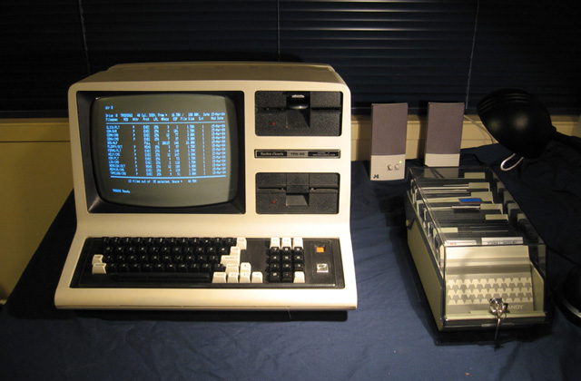

# trsmount - TRS-80 Disk Image FUSE Driver

**trsmount** allows you to mount TRS-80 disk images (`.dmk`, `.dsk`) as local directories on your computer. This enables you to read and write files to legacy TRSDOS and NEWDOS/80 disks using standard tools like Finder, Explorer, or the terminal.



## Motivation

Accessing data on vintage TRS-80 disk images often requires specialized tools or emulators. **trsmount** bridges the gap by integrating these images directly into your modern operating system.

This is particularly powerful when combined with modern development toolchains. For example, using Visual Studio Code with the [TRS-80 gp Extension](https://github.com/TechPrototyper/trs80gpExt), you can compile your code and then seamlessly copy the resulting binaries (e.g., `MYPROG.CMD`) directly onto a virtual floppy disk. The driver automatically handles the conversion to TRSDOS format (e.g., `MYPROG/CMD`), making the workflow from "Code" to "Running on TRS-80" frictionless.

## Features

- **Read/Write Support**: Copy files to and from disk images.
- **Format Support**: Handles DMK and DSK container formats.
- **Filesystem Support**: Supports TRSDOS 2.3 and NEWDOS/80 filesystems.
- **Superzap Utility**: Includes a sector-level inspector for low-level analysis.
- **Catasm Utility**: A specialized viewer for TRS-80 Assembler source files, handling high-bit ASCII and formatting.

## Supported Platforms

- **macOS**: Primary target platform. Requires [FUSE-T](https://github.com/macos-fuse-t/fuse-t) (recommended) or macFUSE.
- **Linux**: Planned for future releases. Contributors are welcome to help verify and extend support!
- **Python 3.6+**

## Installation

### Homebrew (macOS) - *Recommended*

The preferred installation method on macOS is via Homebrew:

```bash
brew tap TechPrototyper/trsmount
brew install trsmount
```

### Manual Installation (setup.sh)

Until the Homebrew formula is published, or for Linux users, you can use the included setup script. This script creates a virtual environment and installs the necessary dependencies.

```bash
./setup.sh
```

### Developer Install

This project is configured as a standard Python package. You can install it in editable mode:

```bash
pip install -e .
```

## Usage

### Mounting a Disk

```bash
trsmount disk.dmk ./mnt
```

You can now access `./mnt` to see the files. When finished, unmount the directory:

```bash
umount ./mnt
```

(Note: On macOS, you can also use `diskutil unmount ./mnt`)

### Utilities

#### Superzap (Disk Inspector)

Use the `superzap` utility to view raw sectors of a disk image:

```bash
superzap disk.dmk
```

#### Catasm (Assembler Source Viewer)

TRS-80 assembler files often use high-bit ASCII characters for compression and specific formatting. `catasm` allows you to view these files in a readable format on modern systems.

```bash
# View a file
catasm FILE.ASM

# View without line numbers (useful for diffs or re-assembly)
catasm -n FILE.ASM

# Add colons to labels (for compatibility with some modern assemblers)
catasm -c FILE.ASM

# Combine options and pipe to an assembler (e.g., zmac)
catasm -n -c FILE.ASM | zmac -
```

## Resources

- [Tim Mann's TRS-80 Pages](http://www.tim-mann.org/trs80.html) - Essential emulator and technical info.
- [Ira Goldklang's TRS-80 Revived Site](http://www.trs-80.com/) - Comprehensive history and archive.
- [48k.ca](https://48k.ca/) - George Phillips great pool of resources, including world's most famous trs80gp TRS-80 emulator.
- [Willus.com TRS-80 Library](http://www.willus.com/trs80/) - Massive archive of manuals and software.

## License

**MIT License**

This software is provided "as is", without warranty of any kind, express or implied, including but not limited to the warranties of merchantability, fitness for a particular purpose and noninfringement. In no event shall the authors or copyright holders be liable for any claim, damages or other liability, whether in an action of contract, tort or otherwise, arising from, out of or in connection with the software or the use or other dealings in the software.

*Note: This software interacts with legacy filesystem formats. While every effort has been made to ensure reliability, disk images may contain third-party software or data with their own licensing restrictions. The user assumes all risks associated with modifying disk images.*
